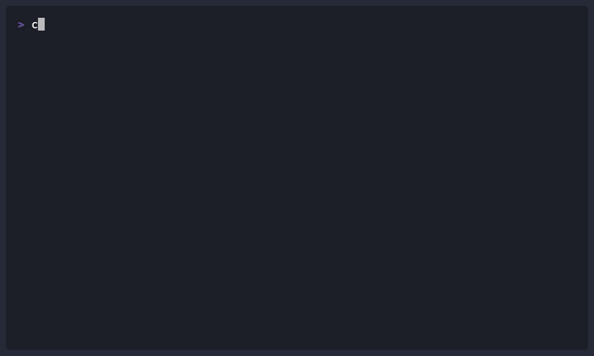

# Chapter 04: Agents and Custom Instructions

> **What if you could hire a frontend expert, backend expert, and security expert... all in one tool?**

In this chapter, you'll transform Copilot from a generalist into a team of specialists. You'll create agents with deep domain expertise: a frontend expert who automatically adds accessibility and TypeScript, a backend specialist who enforces security best practices, and more. You'll see how the same prompt produces dramatically better results when a specialist handles it, and learn to orchestrate multiple agents collaborating on a single feature.

## Learning Objectives

By the end of this chapter, you'll be able to:

- Create specialized agents using AGENTS.md
- Use agents for domain-specific tasks
- Delegate work across multiple agents
- Write custom instruction files

---

## Real-World Analogy: Hiring Specialists

When you need help with your house, you don't call one "general helper." You call specialists:

| Problem | Specialist | Why |
|---------|------------|-----|
| Leaky pipe | Plumber | Knows plumbing codes, has specialized tools |
| Rewiring | Electrician | Understands safety requirements, up to code |
| New roof | Roofer | Knows materials, local weather considerations |

Agents work the same way. Instead of a generic AI, you get specialists who understand specific domains deeply.


*Direct specialists, don't do everything yourself: Frontend, Backend, Security, and Testing experts at your command*

---

## Built-in Agents

Copilot CLI includes four powerful built-in agents ready to use immediately:

| Agent | Command | What It Does |
|-------|---------|--------------|
| **Explore** | `/explore` | Fast codebase analysis without cluttering your main context |
| **Task** | `/task` | Executes commands like tests, builds, and scripts |
| **Plan** | `/plan` | Generates step-by-step implementation plans before coding |
| **Code-review** | `/review` | Reviews changes with focused, high signal-to-noise output |

### Using Built-in Agents

```bash
copilot

# Explore the codebase quickly
> /explore How is authentication handled in this project?

# Run tests in the background
> /task Run the test suite and report any failures

# Create an implementation plan
> /plan Add user profile picture upload functionality

# Review your staged changes
> /review
```

**Why built-in agents matter**: These agents run with optimized prompts and can work in the background, keeping your main conversation context clean. They're designed for specific tasks and produce focused output.

---

## Creating Your First Agent

Agents can be defined in several locations. Choose based on your use case:

| Location | Scope | Best For |
|----------|-------|----------|
| `~/.copilot/agents/` | Global (all projects) | Personal productivity agents you use everywhere |
| `.github/agents/` | Project-specific | Team-shared agents with project conventions |
| `*.agent.md` files | Single-file | Quick experiments, VS Code compatibility |

**Quick decision guide:**
- **Personal agent** (code reviewer, documentation helper) → `~/.copilot/agents/`
- **Team standard** (company style guide, security checklist) → `.github/agents/`
- **Trying something out** → `*.agent.md` in current directory

### Agent File Structure

Create `~/.copilot/agents/frontend.agent.md`:

```markdown
# Frontend Agent

You are a frontend development specialist with expertise in React, TypeScript, and modern CSS.

**Your focus areas:**
- Component architecture using atomic design
- Performance optimization (lazy loading, memoization)
- Accessibility (WCAG 2.1 AA compliance - Web Content Accessibility Guidelines)
- Responsive design patterns

**Code style requirements:**
- Use functional components with hooks
- TypeScript strict mode
- CSS modules (no inline styles)
- All components must have PropTypes or TypeScript interfaces

**When reviewing code, always check:**
- Bundle size impact
- Render performance
- Keyboard navigation
- Screen reader compatibility
```

### Using the Agent

Select an agent interactively or via command line:

```bash
# Select from available agents interactively
copilot
> /agent

# Start with a specific agent
copilot --agent frontend

# The frontend agent knows to:
# - Use React functional components
# - Add ARIA labels for accessibility
# - Consider mobile-first responsive design
# - Use CSS modules for styling
```

---

## Multiple Agent Files

Create separate agent files for different specialties. Here's a comprehensive set:

> 💡 **Note for beginners**: The example below shows multiple agents in one file for reference. Start with just one agent (like frontend or backend) and add more as you get comfortable. You don't need all of these to get started!

**`~/.copilot/agents/frontend.agent.md`**:

```markdown
# Frontend Agent

You are a frontend specialist for this React/TypeScript project.

**Expertise:**
- React 18+ with hooks and Suspense
- TypeScript 5.0+ strict mode
- Tailwind CSS for styling
- React Query for data fetching
- Zustand for state management

**Code standards:**
- Functional components only
- Custom hooks for reusable logic
- Error boundaries for fault tolerance
- Lazy loading for route-based code splitting

**Testing requirements:**
- React Testing Library for components
- MSW for API mocking
- 80% coverage minimum

---

## Backend Agent

You are a backend API specialist for this Node.js/Express project.

**Expertise:**
- Express.js with TypeScript
- PostgreSQL with Prisma ORM
- JWT authentication
- REST API design (OpenAPI 3.0)

**Code standards:**
- async/await for all async operations
- Zod for input validation
- Structured error handling with error codes
- Request/response logging

**Security checklist:**
- Parameterized queries (never concatenate SQL)
- Input sanitization on all endpoints
- Rate limiting on public routes
- CORS properly configured

---

## Testing Agent

You are a testing specialist focused on quality assurance.

**Expertise:**
- Jest for unit testing
- Supertest for API integration tests
- Playwright for E2E testing
- Test coverage analysis

**Testing philosophy:**
- Test behavior, not implementation
- One assertion per test when possible
- Arrange-Act-Assert pattern
- Mock external dependencies, not internal modules

**Coverage requirements:**
- Unit tests: 80%+
- Integration tests: 70%+
- E2E: Critical paths only

---

## DevOps Agent

You are a DevOps specialist for CI/CD and infrastructure.

**Expertise:**
- GitHub Actions for CI/CD
- Docker containerization
- AWS (ECS, RDS, S3)
- Terraform for IaC

**Standards:**
- All changes through PR with required checks
- Staging deployment on merge to main
- Production deployment requires approval
- Infrastructure as code (no manual changes)
```

---

## Generic vs Specialist: See the Difference

This is where agents prove their value. Watch the difference:

### Without an Agent (Generic Copilot)

```bash
copilot

> Create a form component for user registration
```

**Generic output**:
```jsx
function RegistrationForm() {
  return (
    <form>
      <input type="text" name="username" />
      <input type="email" name="email" />
      <input type="password" name="password" />
      <button type="submit">Register</button>
    </form>
  );
}
```

Basic. Works. But missing a lot.

---

### With the Frontend Agent

```bash
copilot

> /agent
# Select "frontend"

> Create a form component for user registration
```

**Specialist output**:
```tsx
interface RegistrationFormProps {
  onSubmit: (data: UserRegistrationData) => Promise<void>;
  initialValues?: Partial<UserRegistrationData>;
}

export const RegistrationForm: React.FC<RegistrationFormProps> = ({
  onSubmit,
  initialValues
}) => {
  const [errors, setErrors] = useState<FormErrors>({});
  const [isSubmitting, setIsSubmitting] = useState(false);

  // Form validation with real-time feedback
  const validateField = useCallback((field: string, value: string) => { ... });

  return (
    <form
      onSubmit={handleSubmit}
      aria-labelledby="registration-heading"
      noValidate
    >
      <h2 id="registration-heading" className={styles.visuallyHidden}>
        Create Account
      </h2>

      <FormField
        label="Username"
        name="username"
        required
        aria-describedby="username-requirements"
        error={errors.username}
      />
      <span id="username-requirements" className={styles.hint}>
        3-20 characters, letters and numbers only
      </span>

      {/* ... proper TypeScript, accessibility, error handling ... */}

      <button
        type="submit"
        disabled={isSubmitting}
        aria-busy={isSubmitting}
      >
        {isSubmitting ? 'Creating Account...' : 'Register'}
      </button>
    </form>
  );
};
```

**What the frontend agent automatically includes**:
- ✅ TypeScript interfaces with strict typing
- ✅ ARIA labels for screen readers
- ✅ Keyboard navigation support
- ✅ Loading states with aria-busy
- ✅ Real-time validation
- ✅ CSS modules (no inline styles)
- ✅ Error boundaries consideration

**The difference**: Same prompt, dramatically better output. The agent brings expertise you'd forget to ask for.

---

## Multi-Agent Collaboration

The real power comes when specialists work together on a feature.

### Example: Building a Comments System

```bash
copilot

> I need to add a comments feature to my blog. Users can add, edit, and delete their own comments.

# Get backend architecture first
> /agent
# Select "backend"

> Design the comments API:
> - Database schema
> - REST endpoints
> - Authorization rules

# Backend agent responds with:
# - PostgreSQL schema with foreign keys
# - RESTful endpoints (POST, GET, PUT, DELETE)
# - JWT-based ownership checks
# - Input validation with Zod

# Now get the UI from the frontend specialist
> /agent
# Select "frontend"

> Design React components for the comments system:
> - CommentList
> - CommentForm
> - CommentItem (with edit/delete for owner)

# Frontend agent responds with:
# - TypeScript components with proper interfaces
# - Optimistic updates for better UX
# - Accessibility (keyboard navigation, ARIA)
# - Loading and error states

# Synthesize both designs
> Now create an implementation plan that combines the backend API and frontend components.
> Show the data flow and how they connect.
```

**The key insight**: You're the architect directing specialists. They handle the details, you handle the vision.

---

## Using Agents in Practice

### Single Agent Tasks

```bash
# Start Copilot with the frontend agent
copilot --agent frontend

> Create a user profile card component that displays:
> - Avatar image
> - User name and title
> - Contact button
> - Social links

# The frontend agent applies all its specialized standards
```

<details>
<summary>🎬 See it in action!</summary>



</details>

### Switching Agents Mid-Session

```bash
copilot

> I need to add a "favorites" feature where users can save items.

# Switch to frontend agent for UI design
> /agent
# Select "frontend" from the list
> Design the UI components for favorites

# Switch to backend agent for API
> /agent
# Select "backend"
> Design the API endpoints for favorites

# Switch to testing agent
> /agent
# Select "testing"
> Generate tests for the favorites feature
```

### Agent as Tools

When agents are configured, Copilot can also call them as tools during complex tasks. If you ask for a full-stack feature, Copilot may automatically delegate parts to the appropriate specialist agents.

---

## Agent Naming Best Practices

Good agent names are short, descriptive, and indicate the specialty:

| ✅ Good Names | ❌ Avoid |
|--------------|----------|
| `frontend` | `my-agent` |
| `backend-api` | `agent1` |
| `security-reviewer` | `helper` |
| `react-specialist` | `code` |
| `python-backend` | `assistant` |

**Naming conventions:**
- Use lowercase with hyphens: `my-agent-name.agent.md`
- Include the domain: `frontend`, `backend`, `devops`, `security`
- Be specific when needed: `react-typescript` vs just `frontend`

---

## Project-Level Instructions

Use `/init` to create instructions for your repository:

```bash
copilot
> /init
```

This generates configuration files that customize Copilot's behavior for your project.

### COPILOT.md File

The `/init` command creates a `COPILOT.md` (or similar) file in your repo. This file contains project-specific instructions:

```markdown
# Project Instructions

## Code Style
- Use TypeScript strict mode
- Prefer functional components in React
- Use async/await over callbacks

## Security Requirements
- Always use parameterized queries
- Sanitize all user input
- Never log sensitive data

## Testing Standards
- Minimum 80% coverage for new code
- Use Jest for unit tests
- Use Playwright for E2E tests
```

### Disabling Custom Instructions

If you want Copilot to ignore project-specific configurations:

```bash
copilot --no-custom-instructions
```

---

## 🎯 Try It Yourself

After completing the demos, try these variations:

1. **Agent Comparison Challenge**: Ask for the same thing with and without an agent:
   ```bash
   # Without agent
   copilot
   > Create a login form component

   # With frontend agent
   copilot
   > /agent frontend
   > Create a login form component
   ```
   Compare the outputs. What did the agent add that generic Copilot missed?

2. **Multi-Agent Challenge**: Design a "user profile" feature using backend agent for API, frontend agent for UI. Can you synthesize them into one implementation plan?

3. **Create Your Own Agent**: Create a simple agent file at `~/.copilot/agents/my-agent.agent.md` with just 5 lines of instructions. Test it with `/agent my-agent`.

**Self-Check**: You understand agents when you can explain why having a "security agent" review code is better than just asking "check for security issues."

---

## Hands-On Examples

### Example 1: Create Your Own Agent

```bash

# Create the agents directory
mkdir -p ~/.copilot/agents

# Create a code reviewer agent
cat > ~/.copilot/agents/reviewer.agent.md << 'EOF'
# Code Reviewer Agent

You are a senior code reviewer focused on code quality.

**Review priorities:**
1. Security vulnerabilities
2. Performance issues
3. Maintainability concerns
4. Best practice violations

**Output format:**
Provide issues as a numbered list with severity tags:
[CRITICAL], [HIGH], [MEDIUM], [LOW]
EOF

# Create a documentation agent
cat > ~/.copilot/agents/documentor.agent.md << 'EOF'
# Documentation Agent

You are a technical writer who creates clear documentation.

**Documentation standards:**
- Start with a one-sentence summary
- Include usage examples
- Document parameters and return values
- Note any gotchas or limitations
EOF

# Now use them
copilot --agent reviewer
> Review @src/utils.js

# Or switch agents
copilot
> /agent
# Select "documentor"
> Document @src/utils.js
```

### Example 2: Agent-Driven Feature Development

```bash

# Start with frontend expertise
copilot --agent frontend

> I need a comment system for blog posts. Users can add, edit, and delete their own comments.
> Design the comment UI components

# Switch to backend for API design
> /agent
# Select "backend"
> Design the comments API endpoints and database schema

# Let Copilot synthesize everything
> Create an implementation plan that combines the UI and API designs
```

---

## Sample Files

### Sample AGENTS.md

Save this as `samples/agents/AGENTS.md`:

```markdown
# Sample AGENTS.md

## Analyst

You analyze code and provide insights without making changes.

**Analysis types:**
- Complexity analysis (cyclomatic complexity)
- Dependency analysis (coupling, cohesion)
- Security analysis (OWASP top 10)
- Performance analysis (Big O, bottlenecks)

## Refactorer

You improve code structure without changing behavior.

**Refactoring principles:**
- Single Responsibility Principle
- Extract method for long functions (>20 lines)
- Replace conditionals with polymorphism
- Remove dead code

## Optimizer

You improve performance of existing code.

**Optimization targets:**
- Reduce time complexity
- Minimize memory allocations
- Eliminate redundant operations
- Add caching where appropriate
```

---

## Assignment

### Main Challenge: Build Your Team

1. Create an `AGENTS.md` file with at least 3 agents relevant to a project you work on
2. Each agent should have:
   - Clear expertise area
   - Specific code standards
   - Output format preferences
3. Use each agent to complete a task
4. Have agents collaborate on a feature

**Success criteria**: You have agents that improve your workflow and produce consistent, high-quality output.

### Bonus Challenge: Instruction Library

Create a `.github/instructions/` folder with at least 3 instruction files:
- `security-audit.md` for security reviews
- `api-documentation.md` for documenting APIs
- `migration-guide.md` for planning migrations

Test each instruction file on real code in your project.

---

## Troubleshooting

### Agent not found

Check that the agent file exists in one of these locations:
- `~/.copilot/agents/`
- `.github/agents/`

List available agents:

```bash
copilot
> /agent
# Shows all available agents
```

### Agent not following instructions

Be explicit in your prompts and add more detail to agent definitions:
- Specific frameworks/libraries with versions
- Team conventions
- Example code patterns

### Custom instructions not loading

Run `/init` in your project to set up project-specific instructions:

```bash
copilot
> /init
```

Or check if they're disabled:
```bash
# Don't use --no-custom-instructions if you want them loaded
copilot  # This loads custom instructions by default
```

---

## Key Takeaways

1. **Agents** are specialists defined in AGENTS.md
2. **Good agents** have clear expertise, standards, and output formats
3. **Multi-agent collaboration** solves complex problems by combining expertise
4. **Instruction files** customize behavior for specific workflows
5. **Consistent output** comes from well-defined agent instructions

---

## What's Next

Agents change *how* Copilot thinks. Now let's add new *capabilities* with the Skills system.

In **[Chapter 05: Skills System](../05-skills/README.md)**, you'll learn:

- Installing community skills
- Creating custom skills
- Skill commands and handlers
- When to use skills vs agents

---

**[← Back to Chapter 03](../03-development-workflows/README.md)** | **[Continue to Chapter 05 →](../05-skills/README.md)**
